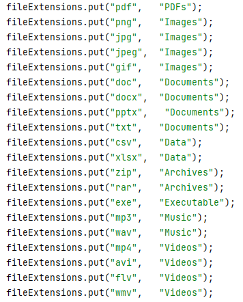

# Number System Converter

A personal project to learn more about manipulating files by creating directories(Folders) and moving files into their respective groups by file extensions. It is also a cool way to flex that I can clean my files in an orderly manner and not have scattered files everywhere.

---

#### Author
This program was developed by [Chriscent Pingol](https://github.com/KishonShrill).

#### Version
This README describes version 2.0 of the File Organizer program.

#### Contacts

If you have any recommendations and/or feedback contact me through [gmail.](mailto:chriscentlouisjune.pingol@g.msuiit.edu.ph)

---

## Table of Contents
#### Users
- [Description](#description)
- [Functionality](#functionality)
- [Supported Extensions](#supported-extensions)
- [How to Use](#how-to-use)
- [Application Error](#error)
#### Programmers and Developers
- [Usage](#usage)

---

## Description

The File Organizer is a Java program designed to organize files into specific folders based on their file extensions. It allows you to specify a directory path, searches for files within that directory, and moves them to categorized folders.

## Functionality
1. The program searches for files in the specified directory and its subdirectories.
2. Each file is categorized based on its file extension and moved to the corresponding folder.
3. The program supports various file extensions and assigns them to appropriate categories such as __PDFs, Images, Documents, Data, Archives, Executables, Music, and Videos.__
4. If a folder for a specific category doesn't exist, it is created automatically.
5. The program displays pop-up messages to inform you about the absolute path of the organized directory, folder creation status, and successful file movement.

## Supported Extensions

## How to Use

Before you open the app, download the latest Java version [here](https://www.java.com/en/download/) and click "Download Java".

- Check whether app came with a folder named __organizeFolder__
    - If not, create a new folder and name it <_organizerFolder_>
    - The application will only look for a folder named <_organizerFolder_>, it is spelling and case-sensitive, only the letter __F__ is capitalized.
- Launch(Open) the File Organizer App.
- The first _Popup_ will appear to show you where the application is currently located.
- The proceeding _Popups_ will inform you that certain folders are created for sorting.
- After you receive the last Popup saying "File Organizer Complete!", check the __organizeFolder__ to see your newly organized files in their respective folders.

## Error

Can't open file - "A java exception has occurred"
- [Install](http://www.oracle.com/technetwork/java/javase/downloads/index.html) or Upgrade the [latest jdk version](http://www.oracle.com/technetwork/java/javase/downloads/index.html). You can upgrade it by uninstalling the older version from control panel and installing newer version of jdk. Get the new version [here (Oracle Java)](http://www.oracle.com/technetwork/java/javase/downloads/index.html)

---

# For programmers and Developers
## Usage
1. Compile and run the `FileOrganizer` class.
2. Specify the directory path where the files to be organized are located.
3. The program will search for files in the specified directory and its subdirectories.
4. Files will be categorized based on their extensions and moved to respective folders.
5. Pop-up messages will provide information on the process, including the absolute path of the organized directory.